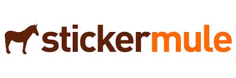

meta
====
*the repo behind the repos*

Please create a Github Issue on this repository for anything related to BeerJS generally,
for example, to ask for the creation of a new repo for your local chapter of BeerJS

We use github (this website!) to discuss things. If you're not used to that, here's a [quick video intro](https://www.youtube.com/watch?v=KlrJVSJRUN4).

Also, you can [chat with us on slack](https://beerjs-slack-invite.herokuapp.com/)!

## fork a beerjs in your city

Anyone can do it- why not you? Please open an issue on this repo and clearly state:
- **the github usernames of everyone who should be an admin on the repo**. we find that having at least 2 is best, but if it's just you, that's fine for now.
- **the name of the repo**. this becomes the url slug, eg `beerjs/foo`. if your city has a short name, like an airport code, that's fine. whatever you like that's still recognizable as your city.
- **bonus: gifs or emoji** are always welcome
- we will try to get you setup within in a couple of days.  Sometimes it may take a little longer as this is us giving time to the JS community.  Please have a little patience if things do not happen as fast as you want.  Its is totally ok to ask for an update in the comments :)

Once you have a repo created, encourage people in your town to "watch" the repo to subscribe to notifications for issues on github. Issues are a great way to propose, plan, and remind people of upcoming events. Filling out a readme, description, and optional URL to your repo will help people know what's going on and want to come to your cool event. Feel free to borrow text and formatting from other beer.js repos.

## [beerjs is on Slack](https://beerjs.slack.com)

We have a slack team now! Join it [here](https://beerjs-slack-invite.herokuapp.com/)  Each city is encouraged to create their own channel.

## get help organizing

A great way is to open an issue, or browse through some of the repos from other cities to see what they're up to.

## code of conduct

All events, activities, and internet spaces which bear the beer.js name are subject to the [Citizen Code of Conduct](http://citizencodeofconduct.org/). Simply stated, harassment of any form will not be tolerated and should be reported to your local organizer or to papaleowebdev@gmail.com. Please drink responsibly and act in a way that honors the community values of respect and mutual enrichment which we share.

## a note about beer

beer.js is about creating social spaces to strengthen software communities. There is no requirement to drink to participate.

## tools to help you

Starting a JS community is not always easy.  Here are some [tools](https://github.com/beerjs/meta/blob/master/utils.md) to help you plan you events.

Feel free to create a pull request if you have useful rsources for our group.

## why organize on Github?
See this thread from a local chapter: https://github.com/beerjs/abq/issues/6

## stickers
Honestly, who doesn't love a good sticker.  This is a great option if you want to buy a couple of stickers: [BeerJS Sticker](https://www.stickermule.com/marketplace/11293-beerjs)

There is another option if you run your local BeerJS events.  [Sticker Mule](https://www.stickermule.com) would like to support you, your efforts, and help our community grow.  You will need to email [Justin Dorfman](mailto:jdorfman@stickermule.com), the Director of Developer Relations and he will help you out big time.

Huge thank you to:

## contact

to the extent that anyone "runs" beerjs, it's these folks:

- @voodootikigod, jsconf
- @cramforce, jsconfeu
- @jordanpapaleo, student, teacher, coder

The best way to get in touch with one of us is through the issues on this repo.

@jordanpapaleo can also be reached by email, papaleowebdev@gmail.com

cheers & beers :beers:
